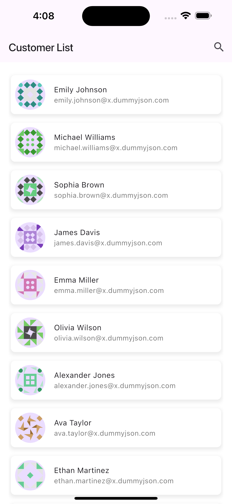
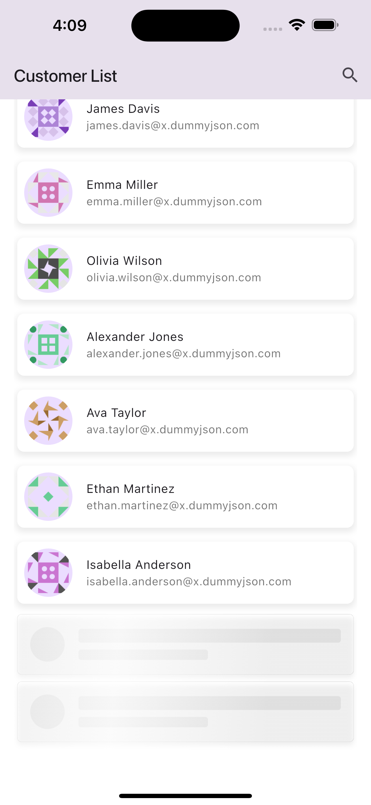
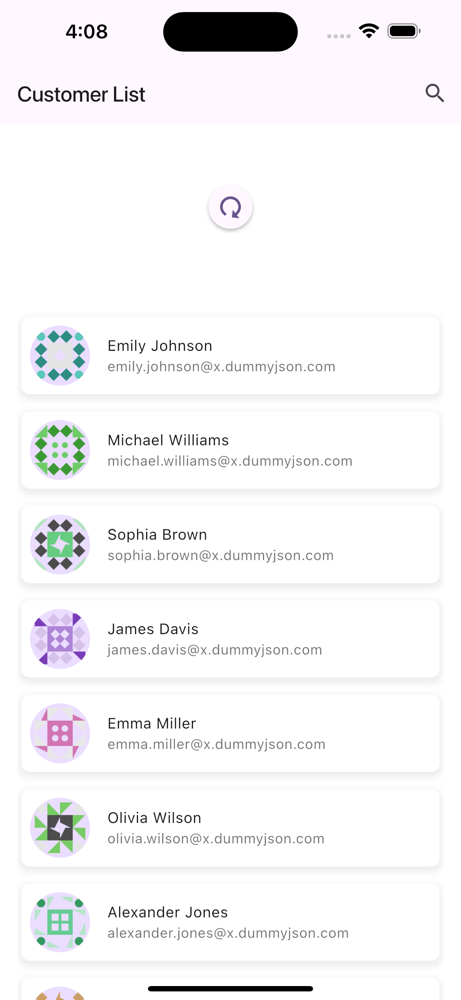
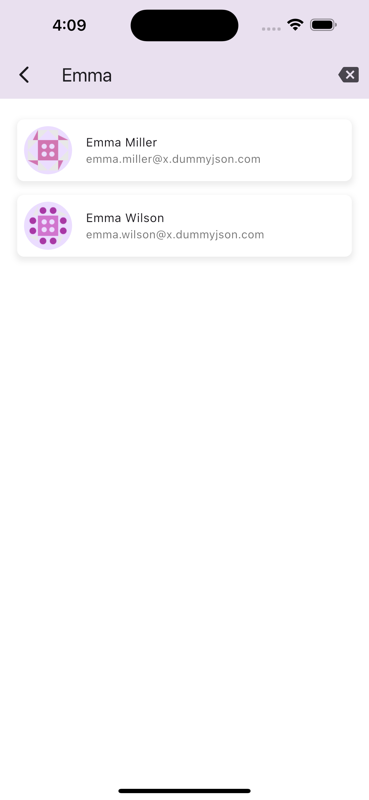
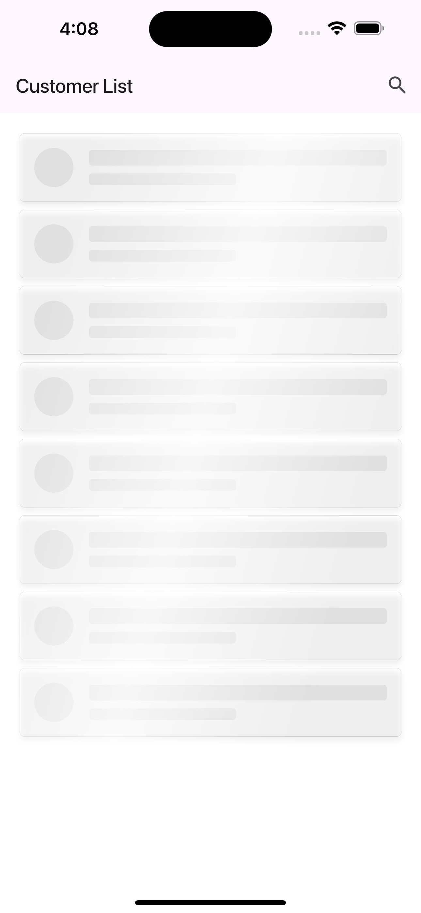
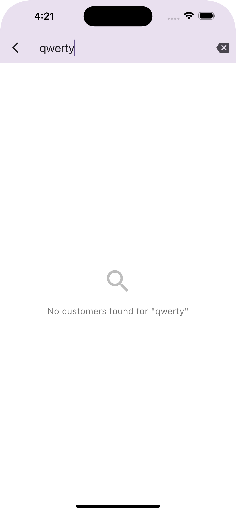

# Paginated Contact List

Paginated Contact List App

## 🎥 Video Demo

 

## 📸 Screenshots
| Customer List | Infinite Loading | Pull to Refresh |
|------|-------|-------|
||||
| App Bar Search | Skeleton Loader | Search Error Page |
||||

 

## ✨ Features
* **Paginated contact list**: Browse contacts with seamless infinite scrolling and pagination.
* **App bar with search**: Instantly filter contacts using the integrated search bar.
* **Pull to refresh**: Reload the contact list easily with a swipe gesture.
* **Skeleton loading**: Displays animated placeholders while loading data.
* **Error handling**: User-friendly error pages for network or search issues.
* **Packages:**
    * **dio**: Handles all network requests to fetch contact data from the API.
    * **infinite_scroll_pagination**: Powers the infinite scrolling and pagination of the contact list.
    * **app_bar_with_search_switch**: Provides the app bar with integrated search for filtering contacts.
    * **skeleton_loader**: Shows loading placeholders while contact data is being fetched.
    * **pull_to_refresh**: Enables pull-to-refresh to reload the contact list easily.
    * **gap**: Adds consistent spacing between UI elements for a clean layout.
    

    